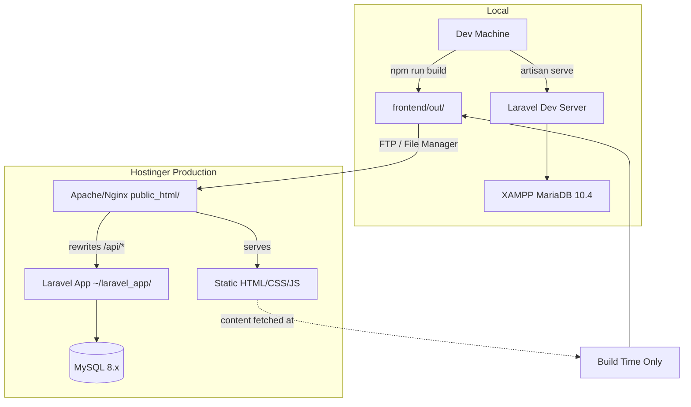

# Architecture Spine — Adsvance Media Tech CMS

## Design Paradigm

**Domain-Driven Design (Layered)** — Each business capability is a self-contained domain with its own Models, Relationships, and Filament Resources. Domains communicate only through the API/HTTP layer (backend → frontend) or through shared kernel models (the `packages/shared` Zod schemas). Within the backend, a domain never reaches into another domain's models directly.

```
┌──────────────────────────────────────────────────────────┐
│                    MONOREPO ROOT                          │
│  package.json (npm workspaces)                            │
├──────────────────────────────────────────────────────────┤
│                                                           │
│  apps/                                                    │
│  ├── backend/    Laravel 12 + Filament 5     ◄── Auth    │
│  │   └── app/Domains/{Domain}/                            │
│  │       ├── Models/     Eloquent models + relationships  │
│  │       ├── Filament/   Admin panel resources            │
│  │       └── Http/API    REST JSON API controllers        │
│  │                                                         │
│  └── frontend/   Next.js 16 (SSG)          ◄── Public    │
│      ├── app/          App Router pages                   │
│      ├── components/   React components                   │
│      └── lib/          API client + theme context         │
│                                                           │
│  packages/                                                │
│  └── shared/         Zod schemas (TypeScript)             │
│                                                           │
└──────────────────────────────────────────────────────────┘
```

**Dependency direction:** `apps/frontend` → `packages/shared` (imports Zod schemas). `apps/backend` mirrors validation from `packages/shared` concepts but owns its own validation via Laravel FormRequest classes — shared schemas are a TypeScript-side reference, not the backend's source of truth. Apps never import from other apps.

---

## Invariants & Rules

### AD-1 — Domain boundaries are isolated

- **Binds:** All backend code (FR-1 through FR-14)
- **Prevents:** A Marketing model importing a Billing model directly; cross-domain tight coupling
- **Rule:** Each DDD domain (`Marketing`, `Billing`, `Contact`, `Theming`, `Identity`) owns its Eloquent models, migrations, relationships, and Filament resources completely. Cross-domain data access goes through injected service classes or repository methods — never direct model imports. The API layer (`routes/api.php`) is the only cross-domain orchestrator.

### AD-2 — Frontend is a static consumer

- **Binds:** FR-7, FR-8, FR-15
- **Prevents:** The Next.js server reaching into the database; dynamic server-rendered pages that require a Node runtime
- **Rule:** The Next.js frontend runs in SSG mode (`output: 'export'`). All data is fetched at build time via `fetch()` to the Laravel REST API. No database connections, no server-side state, no `getServerSideProps`. The built `out/` folder is a flat directory of HTML/CSS/JS served by Hostinger's Apache/Nginx with no Node.js runtime.

### AD-3 — REST API is the contract

- **Binds:** FR-15
- **Prevents:** Frontend and backend diverging on data shapes; silent breaking changes
- **Rule:** All public data flows through `GET /api/*` endpoints. All submissions through `POST /api/*`. Responses follow a consistent JSON envelope: `{ "data": ... }` for success, `{ "message": "...", "errors": {...} }` for validation failures. `packages/shared` contains Zod schemas mirroring the API response shapes — used by the frontend for type safety and build-time validation. Backend validation (Laravel FormRequest) is the authority; Zod schemas in `packages/shared` are the TypeScript projection.

### AD-4 — Theme system uses CSS custom properties

- **Binds:** FR-6, FR-7
- **Prevents:** Hardcoded colors and fonts across the frontend; per-component theme overrides that break under rebranding
- **Rule:** Theme settings are stored as key-value pairs in the `ThemeSetting` model, exposed via `GET /api/theme` as a flat JSON object. The Next.js frontend writes these values into CSS custom properties on `:root` at build time. Tailwind CSS extends its `colors` and `fontFamily` from `var(--color-*)` and `var(--font-*)`. No component hardcodes a brand color or font — every visual token resolves through a CSS variable.

### AD-5 — Admin is the sole content authority

- **Binds:** FR-1 through FR-6, FR-11, FR-12, FR-13, FR-14
- **Prevents:** Direct database writes bypassing Filament validation; public users writing content
- **Rule:** All content creation, update, and deletion happens through Filament resources or custom Filament pages. The public API is read-only (`GET`) except for contact form and newsletter POST endpoints. There is no public content-management API. Admin authentication is required for all write operations via Filament's built-in auth (`/admin/login`).

### AD-6 — Media is managed by Spatie Media Library

- **Binds:** FR-4, FR-5, FR-6, FR-14
- **Prevents:** File storage scattered across models; orphaned files on model deletion; inconsistent upload handling
- **Rule:** All file uploads (team photos, blog images, logos, page images) go through Spatie Media Library. Files are stored in `storage/app/public/` with a symlink at `public/storage/`. Each model defines its media collections (e.g., `TeamMember` has a `photo` collection, `ThemeSetting` has `light_logo` and `dark_logo` collections). Deleting a model cascades to its media. The frontend accesses media via the Laravel public URL.

### AD-7 — Content flow is unidirectional

- **Binds:** All FRs
- **Prevents:** Circular data dependencies; stale content disagreements between admin and public site
- **Rule:** Data flows in one direction only:

```
Admin writes ──► MySQL ──► REST API ──► Next.js build ──► Static HTML
  (Filament)         (storage)    (GET /api/*)   (SSG export)     (Hostinger)
```

A content change in the admin panel is reflected on the public site only after the Next.js build runs and the `out/` folder is deployed. The admin panel does not trigger a build — that is a separate deploy step. Admin users are trained to expect this: content is *ready* after save, *live* after deploy.

### AD-8 — Queued email with database-backed fallback

- **Binds:** FR-9
- **Prevents:** Lost contact form submissions when the mail server is down
- **Rule:** Contact form submissions are saved to `contact_contact_messages` before the email is dispatched. Email dispatch runs through Laravel's queue (database driver — no Redis dependency). If the email fails, it is retried up to 3 times. The message record in the database survives regardless of email delivery status. Marking a message as read is a manual admin action — there is no automatic read-receipt mechanism.

---

## Consistency Conventions

| Concern | Convention |
|---------|-----------|
| **Naming — Models** | Singular, PascalCase: `Service`, `PricingPlan`, `BlogPost`, `TeamMember`, `ContactMessage`, `Subscriber`, `ThemeSetting`, `Page` |
| **Naming — Migrations** | `{timestamp}_{action}_{table}`: `create_marketing_services_table`, `add_sort_order_to_marketing_services_table` |
| **Naming — API routes** | `GET /api/{resource}`, `GET /api/{resource}/{id}`, `POST /api/{resource}`; kebab-case for multi-word: `/api/pricing-plans`, `/api/blog-posts` |
| **Naming — Database tables** | `{domain}_{entity}` plural snake_case: `marketing_services`, `billing_pricing_plans`, `contact_contact_messages`, `theming_theme_settings` |
| **Naming — Filament resources** | `{Entity}Resource` within the domain's `Filament/Resources/` directory |
| **Naming — Frontend components** | PascalCase: `ServiceCard`, `PricingTable`, `BlogCard`, `ThemeProvider`, `ContactForm` |
| **Naming — Frontend pages** | kebab-case directories under `app/`: `app/blog/[slug]/page.tsx`, `app/_components/` for shared components |
| **Data format — IDs** | Auto-increment integers (Laravel default). Exposed as integers in the API. |
| **Data format — Dates** | ISO 8601 in API responses. Carbon-based in backend storage. |
| **Data format — Prices** | `decimal(10, 2)` in MySQL, formatted as PHP peso string (`₱XXX`) in the frontend display layer |
| **Data format — Error envelope** | `{ "message": "...", "errors": { "field": ["..."] } }` on HTTP 422; `{ "message": "..." }` on HTTP 500 |
| **State — Frontend** | React Server Components with no client-side state management library. Client components only where interactivity is required (contact form, newsletter subscribe, mobile hamburger). |
| **Rate limiting** | Contact form: max 5 submissions per IP per minute. Newsletter: max 3 per IP per minute. Implemented via Laravel's `RateLimiter` facade on the API route, database-backed (no Redis). |
| **Content sanitization** | All rich text content (blog post body) sanitized before public render via HTMLPurifier or equivalent library. Strip disallowed tags, allow only safe HTML (headings, lists, links, images, bold, italic). |
| **CORS** | Restricted to the deployed frontend domain in production. Allow `*` in local development. Configured via Laravel CORS config (Laravel's built-in `config/cors.php` or a CORS middleware). |
| **Configuration** | Environment-driven via `.env`. `CONTACT_NOTIFICATION_EMAIL`, `APP_NAME`, `APP_URL`, `DB_*`, `MAIL_*`. No hardcoded config in code. |
| **Logging** | Laravel default stack (single file in dev, syslog in production). No external logging service in v1. |

---

## Stack

> **NOTE:** The versions below have been verified against current package registries (July 2026) and differ from the earlier PRD addendum. Laravel 11 has passed its security support window → pinned to Laravel 12. Next.js 14 is EOL → pinned to Next.js 16.2.10 LTS. Filament has advanced from v3 to v5.7 — same product, significant API improvements, retains all required functionality.

| Name | Version | Purpose | License |
|------|---------|---------|---------|
| PHP | 8.2.12 | Runtime (local) — Hostinger supports 8.2 | — |
| Laravel | 12.x | Backend framework — confirmed current LTS (bug fixes until Aug 2026, security until Feb 2027) | MIT |
| Filament | 5.7.x | Admin panel framework — replaces v3 from PRD (current stable) | MIT |
| Spatie Media Library | 11.x | File/media management | MIT |
| MariaDB | 10.4 | Database (local via XAMPP) — MySQL-compatible | GPL v2 |
| MySQL | 8.x | Database (Hostinger production) | GPL v2 |
| Node.js | 20.17.0 | Frontend tooling runtime | MIT |
| Next.js | 16.2.10 | React framework (SSG via `output: 'export'`) | MIT |
| React | 19.x | UI library (bundled with Next.js 16) | MIT |
| TypeScript | 5.x | Type safety for frontend | Apache 2.0 |
| Tailwind CSS | 4.x | Utility CSS — v4 required by Filament 5 | MIT |
| Quill.js | 2.x | Rich text editor for blog posts | BSD-3-Clause |
| Font Awesome Free | 6.x | Public site icons | CC BY 4.0 + MIT |
| Blade Heroicons | Latest | Admin panel icons (Filament default) | MIT |
| Zod | 3.x | Schema validation in `packages/shared` | MIT |
| Livewire | 4.x | Laravel reactive UI (Filament dependency) — v4 required by Filament 5 | MIT |

### Version change notes (`[ASSUMPTION]`)

- **Laravel 11 → 12:** Laravel 11's security support ended March 12, 2026. Laravel 12 is the current LTS (security until Feb 2027). PHP 8.2 is compatible with both — no migration blockers. `[ADOPTED]`
- **Next.js 14 → 16.2.10:** Next.js 14's security support ended Oct 26, 2025. Next.js 16.2.10 is the current stable LTS. Static export via `output: 'export'` is fully supported. The App Router API is stable and well-documented. `[ADOPTED]`
- **Filament 3 → 5.7:** Filament v3 reached end-of-life. Filament 5.7 is the current stable release. It requires Tailwind CSS v4 and Livewire v4. Admin panel patterns (resources, tables, forms, widgets) are conceptually identical but the API surface has evolved. All PRD-required features (CRUD, auth, dashboard widgets, sidebar navigation, mode) are present in v5. `[ADOPTED]`

---

## Structural Seed

```
adsvance-media-tech-cms/
├── package.json                 # npm workspaces root
├── apps/
│   ├── backend/                 # Laravel 12
│   │   ├── app/
│   │   │   ├── Domains/
│   │   │   │   ├── Marketing/
│   │   │   │   │   ├── Models/
│   │   │   │   │   │   ├── Page.php
│   │   │   │   │   │   ├── Service.php
│   │   │   │   │   │   ├── TeamMember.php
│   │   │   │   │   │   └── BlogPost.php
│   │   │   │   │   └── Filament/
│   │   │   │   │       └── Resources/
│   │   │   │   │           ├── PageResource.php
│   │   │   │   │           ├── ServiceResource.php
│   │   │   │   │           ├── TeamMemberResource.php
│   │   │   │   │           └── BlogPostResource.php
│   │   │   │   ├── Billing/
│   │   │   │   │   ├── Models/
│   │   │   │   │   │   ├── PricingPlan.php
│   │   │   │   │   │   └── PlanFeature.php
│   │   │   │   │   └── Filament/Resources/
│   │   │   │   │       ├── PricingPlanResource.php
│   │   │   │   │       └── PlanFeatureResource.php
│   │   │   │   ├── Contact/
│   │   │   │   │   ├── Models/
│   │   │   │   │   │   ├── ContactMessage.php
│   │   │   │   │   │   └── Subscriber.php
│   │   │   │   │   └── Filament/Resources/    (v1.1)
│   │   │   │   ├── Theming/
│   │   │   │   │   ├── Models/
│   │   │   │   │   │   └── ThemeSetting.php
│   │   │   │   │   └── Filament/Pages/
│   │   │   │   │       └── ThemeSettingsPage.php
│   │   │   │   └── Identity/
│   │   │   │       └── Models/
│   │   │   │           └── User.php            (Filament built-in)
│   │   │   ├── Http/
│   │   │   │   └── Controllers/Api/
│   │   │   │       ├── PageController.php
│   │   │   │       ├── ServiceController.php
│   │   │   │       ├── TeamMemberController.php
│   │   │   │       ├── BlogPostController.php
│   │   │   │       ├── PricingPlanController.php
│   │   │   │       ├── ThemeController.php
│   │   │   │       ├── ContactController.php
│   │   │   │       └── SubscribeController.php
│   │   │   └── Http/Requests/                  (FormRequest validators)
│   │   ├── database/migrations/                (10 migration files)
│   │   ├── routes/
│   │   │   └── api.php                         (all public API routes)
│   │   └── .env                                (local config)
│   │
│   └── frontend/               # Next.js 16 (SSG)
│       ├── app/
│       │   ├── page.tsx                        # Homepage
│       │   ├── layout.tsx                      # Root layout
│       │   ├── globals.css                     # Custom properties + Tailwind
│       │   ├── blog/
│       │   │   ├── page.tsx                    # Blog listing
│       │   │   └── [slug]/
│       │   │       └── page.tsx                # Single post
│       │   └── not-found.tsx                   # 404
│       ├── components/
│       │   ├── Header.tsx                      # Navbar + mobile hamburger
│       │   ├── Footer.tsx                      # Footer
│       │   ├── HeroSection.tsx
│       │   ├── ServicesGrid.tsx
│       │   ├── PricingTable.tsx
│       │   ├── TeamGrid.tsx
│       │   ├── BlogCard.tsx
│       │   ├── ContactForm.tsx
│       │   ├── NewsletterForm.tsx
│       │   ├── BackToTop.tsx
│       │   └── ThemeProvider.tsx               # CSS custom property injection
│       ├── lib/
│       │   ├── api.ts                          # API client
│       │   └── types.ts                        # Zod-inferred types
│       ├── tailwind.config.ts
│       ├── next.config.ts                      # output: 'export'
│       └── .env.local
│
└── packages/
    └── shared/
        ├── package.json
        ├── tsconfig.json
        └── src/
            ├── schemas/
            │   ├── page.ts
            │   ├── service.ts
            │   ├── team-member.ts
            │   ├── blog-post.ts
            │   ├── pricing-plan.ts
            │   ├── theme.ts
            │   ├── contact.ts
            │   └── subscriber.ts
            └── index.ts
```

### Deployment topology



---

## Capability → Architecture Map

| Capability / Area | Lives in | Governed by |
|------------------|----------|-------------|
| Services CRUD | `Marketing.Service` + `Filament/Resources/ServiceResource` | AD-1, AD-5 |
| Pricing Plans CRUD | `Billing.PricingPlan` + `PlanFeature` | AD-1, AD-5 |
| Blog Posts CRUD | `Marketing.BlogPost` + `Resources/BlogPostResource` | AD-1, AD-5 |
| Team Members CRUD | `Marketing.TeamMember` | AD-1, AD-5 |
| Pages / Sections | `Marketing.Page` | AD-1, AD-5 |
| Theme Settings | `Theming.ThemeSetting` + custom Filament page | AD-4, AD-5 |
| Media Uploads | Spatie Media Library on all content models | AD-6 |
| Contact Form | `Contact.ContactMessage` + API controller | AD-8, AD-3 |
| Newsletter Subscribe | `Contact.Subscriber` + API controller | AD-3 |
| Public REST API | `routes/api.php` + API controllers | AD-3 |
| Admin Auth | Filament `Panel::make()->login()` | AD-5 |
| Frontend SSG | Next.js App Router + `output: 'export'` | AD-2 |
| CSS Theme | `lib/ThemeProvider` + CSS custom properties | AD-4 |
| Shared Types | `packages/shared/` Zod schemas | AD-3 |

---

## Deferred

| Decision | Reason it can wait | Trigger to decide |
|----------|-------------------|-------------------|
| **CI/CD pipeline** | A manual build + FTP push is acceptable for week-one launch. CI adds setup cost and doesn't block any feature. | First production content update after launch |
| **Multi-tenant isolation** | Each client gets their own deployment. No tenant-scoping needed in v1. | First client deployment after v1 |
| **Contact Messages admin panel** (FR-11) | Email notification covers the gap for v1. The data is in the DB. | First complaint about missed inquiries |
| **Subscriber management admin** | Low-value given low volume. Data is queryable directly. | Subscriber count exceeds 100 |
| **SEO meta tag management** | Hardcoded meta tags sufficient for a marketing site with 5 pages. | Blog grows beyond 20 posts |
| **Image auto-optimization** | Manual compression before upload is acceptable. | Team grows beyond 2 people |
| **Role-based access (Spatie Permissions)** | Single admin user in v1. No need for roles. | Second admin user is added |
| **Frontend state management (Zustand/Redux)** | No client-side state beyond form inputs. React Server Components cover the rest. | Any page needs real-time client state |
| **Rate limiting strategy — cache driver** | Database-based rate limiting is fine for v1. Redis would be better but adds infrastructure. | Traffic exceeds 1,000 visits/day |
| **Email deliverability (SMTP relay)** | Hostinger's built-in mail works for low volume. | More than 50 form submissions/day expected |
